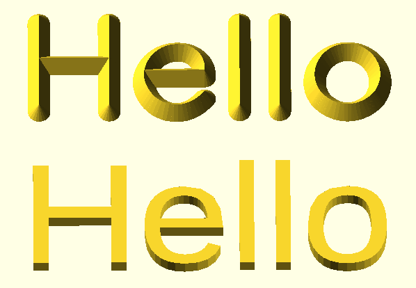

# OneStrokeTextOpenSCAD
 
A common task in 3d-printing is adding text to a design. In OpenSCAD the standard text functions create a simple extrusion of the 2-dimensional True Type font.
The intention of this module is to provide a way of creating text with bevelled edges. Thatis the kind of effect you might get with a chisel or a V-bit in a router.



This kind of text arguably looks prettier, but more importantly there are no flat tops. That makes it suitable for embossing in the bottom face of an FDM printed model without the need to add supports when creating g-code.

The approach taken here is inspired by the [Hershey Text](https://gitlab.com/oskay/hershey-text) extension to Inkscape. The relatively little used SVF font format is used to define a path that descibes the sahpes of the glyphs. The OneStrokeFontToOpenSCAD.py script supplied here produces a OneStrokeFonts.scad file from the data extracted from .svf font files.

For each glyph in each font, the geometry is extracted as a set of lines. For those fonts which contain Bézier curves, the Python script creates an approximation of the curve as a series of straight lines.

OneStrokeText.scad contains OpenSCAD modules to render a string of text using the tables in OneStrokeFonts.scad.

```
use  <OneStrokeText.scad>

VbitText("Hello",40, "Hershey-Sans 1-stroke", 6, 0, 4);
```

The arguments to VbitText() are the text to be rendered, height of the font, the name of the font to use, the d1, d2, h values that define a cone for the virtual V-bit.
The names of the fonts can be seen in the OneStrokeText.scad file.
You might swap d1 and d2 to produce a cut out suitable for use on the bottom face of an object.

The best source fonts I have found so far are “Hershey-Sans 1-stroke.svg” and “Custom-Script.svg”  from [inkscapestrokefont](https://github.com/Shriinivas/inkscapestrokefont). These are very similar to the ones supplied in the Inkscape extension, but Khemadeva / Shriinivas has gone to the trouble of tweaking and  smoothing the paths. His video tutorials on [YouTube](https://www.youtube.com/c/Khemadeva/videos) are well worth looking at if you want to create your own single stroke fonts based on an existing TTF font.

If you want to use this code, get the Python script, and put it in a folder along side “Hershey-Sans 1-stroke.svg” and “Custom-Script.svg”. Run the Python script. This will find all the .svg files in the same directory and create a single file called OneStrokeFonts.scad. Put OneStrokeFonts.scad and OneStrokeText.scad along side your project .scad file and use as shown above.

I have not included an example OneStrokeFonts.scad file to keep licencing issues simple for me. 

The code is very much proof of concept at this stage. It works with the two .svg files specified. It fails with some others I have seen.

If you have performance issues, then keep the number of fonts to a minimum and reduce `line_segments_per_bezier_segment` in the python script.  If you still have performance issues, then you might consider editing the fonts to reduce the number of curve segments or glyphs in the font.

